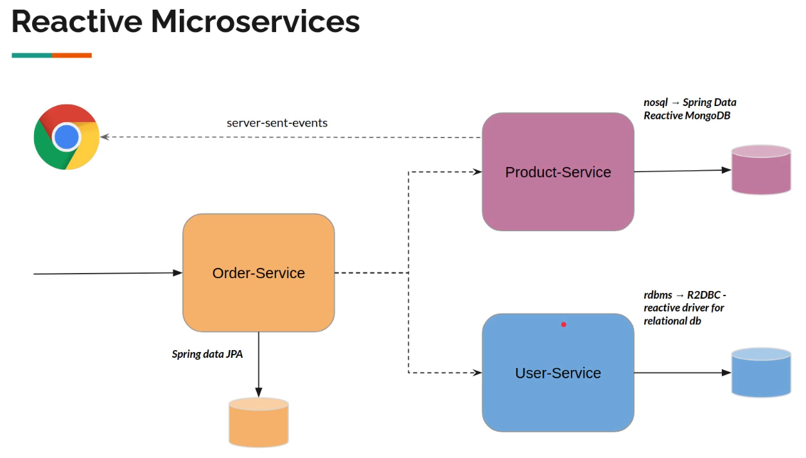
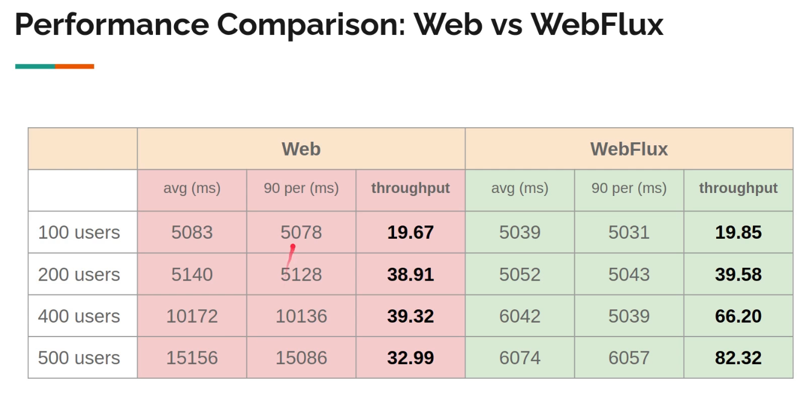

# Reactive Microservices with Spring WebFlux

[Reactive programming articles](https://www.vinsguru.com/category/reactive-programming/)

https://www.vinsguru.com/microservices-architecture-how-to-share-dto-data-transfer-objects/

https://www.vinsguru.com/timeout-pattern/

https://www.vinsguru.com/retry-pattern/

https://www.vinsguru.com/circuit-breaker-pattern/

https://www.vinsguru.com/bulkhead-pattern/

https://www.vinsguru.com/rate-limiter-pattern/

https://www.vinsguru.com/spring-data-r2dbc-transaction/

https://www.vinsguru.com/r2dbc-entity-callback/

https://www.vinsguru.com/spring-webflux-file-upload/

https://www.vinsguru.com/spring-webflux-security/
